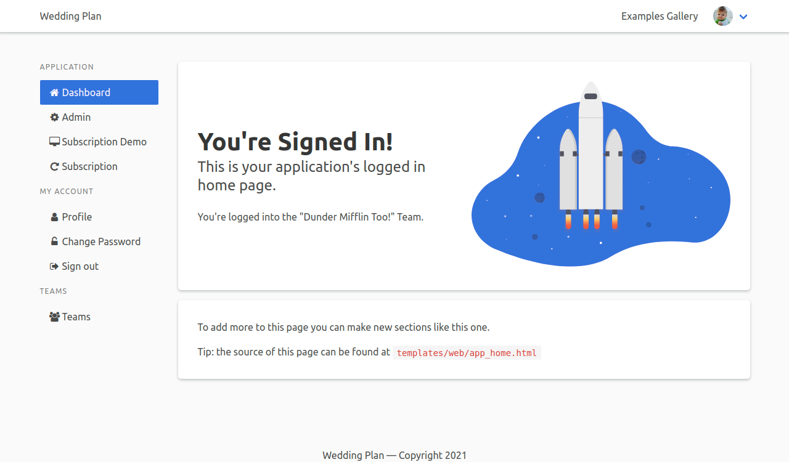

CSS
===

## Supported Frameworks

Pegasus sites can be built using [Bootstrap 5](https://getbootstrap.com/) or [Bulma](https://bulma.io/).
The look and feel of the site is slightly different between the two, but the overall layout and
color scheme is the same.

**Bootstrap Version:**


**Bulma Version:**



If you're not sure which framework you want to use, you can also
[build Pegasus for both frameworks](##building-for-multiple-css-frameworks),
and change dynamically at runtime.

## CSS File Structure

CSS source files live in the `assets/styles` folder, and are compiled into the `static/css` folder.
Styles are written using [Sass](https://sass-lang.com/), which provides many benefits
and features on top of traditional CSS.

**Modifying CSS requires having a functional [front-end build setup](/front-end/).**

All versions of Pegasus contain two main sets of styles:

- Styles that are *framework-independent* are contained and imported in `assets/styles/app/base.sass` 
  and compiled into `static/css/site-base.css`.
- Styles that *extend or override the CSS framework* are contained in `assets/styles/app/<framework>/`
  and compiled into `static/css/site-<framework>.css`.

If you are using a single framework, this split is not required and you can optionally combine everything
into a single file by importing the styles from `base.sass` into your framework file and deleting `site-base.css`.
This optimization is completely optional.

### Pegasus CSS

In addition to the above structure, Pegasus also ships with its own set of CSS classes to provide compatibility
across frameworks. These are mainly used in the examples and in JavaScript files.

Pegasus CSS classes are defined in `pegasus/<framework>.sass`, and they all begin with `pg-`.
You are welcome to leave them in and use them throughout your project.

If you prefer, you can also replace them with the native framework classes (for example, replacing all instances
of `pg-column` with `column` on Bulma, or `col-md` on Bootstrap).

## Customizing your CSS theme

### Bootstrap

Pegasus's file structure is based on [the Bootstrap documentation](https://getbootstrap.com/docs/5.0/customize/sass/#importing).
Any of the variables used in Bootstrap can be changed by modifying the `assets/styles/site-bootstrap.scss` file.

A complete list of available variables can be found in `./node_modules/bootstrap/scss/variables`.

Try adding the following lines to the top of your file to see how it changes things:

```scss
$primary: #2e7636;  // change primary color to green
$body-color: #00008B;  // change main text to blue
```

You'll have to run `npm run dev` to see the changes take.

The [Bootstrap documentation](https://getbootstrap.com/docs/5.0/customize/sass/) has much more detail
on cusotmizing your theme!

### Bulma

Bulma is readily customizable via [Sass variables](https://bulma.io/documentation/customize/variables/).
Any of the variables used by Bulma can be changed by modifying the `assets/styles/site-bulma.scss` file.

Try adding the following lines to the top of your file to see how it changes things:

```scss
$primary: #2e7636;  // change primary color to green
$body-color: #00008B;  // change main text to blue
```

You'll have to run `npm run dev` to see the changes take.


## Building for Multiple CSS Frameworks

If you chose to build for multiple CSS frameworks, you can change frameworks
by changing the `CSS_FRAMEWORK` value in your `settings.py` file.
Valid options are `'bulma'`, `'bootstrap'`, nad `'tailwind'` - though note that [Tailwind CSS is experimental
and not yet supported](/experimental/).
